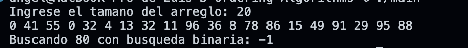

#   Sorting Algorithms

## Description
This programs were done to understand the main concepts, functionality and implementation of the main sorting algorithms. 

## Main Learnings 
* Bubble Sort
* Selection Sort
* Insertion Sort
* Merge Sort
* Quick Sort
* Binary Search

## Installation
* Make sure to have installed a C++ enviroment 
* Download the repository on your local machine
* Run the command <code>./main</code> on the terminal located at the root path of the project

## Screenshots
 
